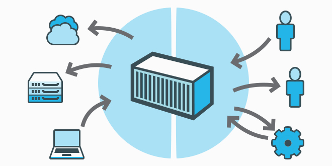

# O que é Docker?

De forma bem resumida, podemos dizer que o Docker é uma plataforma aberta, criada com o objetivo de facilitar o desenvolvimento, a implantação e a execução de aplicações em ambientes isolados. Foi desenhada especialmente para disponibilizar uma aplicação da forma mais rápida possível.

Usando o Docker, você pode facilmente gerenciar a infraestrutura da aplicação, isso agilizará o processo de criação, manutenção e modificação do seu serviço. 

Todo processo é realizado sem necessidade de qualquer acesso privilegiado à infraestrutura corporativa. Assim, a equipe responsável pela aplicação pode participar da especificação do ambiente junto com a equipe responsável pelos servidores.

O Docker viabilizou uma "linguagem" comum entre desenvolvedores e administradores de servidores. Essa nova "linguagem" é utilizada para construir arquivos com as definições da infraestrutura necessária e como a aplicação será disposta nesse ambiente, em qual porta fornecerá seu serviço, quais dados de volumes externos serão requisitados e outras possíveis necessidades.

O Docker também disponibiliza uma nuvem pública para compartilhamento de ambientes prontos, que podem ser utilizados para viabilizar customizações para ambientes específicos. É possível obter uma imagem pronta do apache e configurar os módulos específicos necessários para a aplicação e, assim, criar seu próprio ambiente customizado. Tudo com poucas linhas de descrição.

O Docker utiliza o modelo de container para “empacotar” a aplicação que, após ser transformada em imagem Docker, pode ser reproduzida em plataforma de qualquer porte; ou seja, caso a aplicação funcione sem falhas em seu notebook, funcionará também no servidor ou no mainframe. Construa uma vez, execute onde quiser.

Os containers são isolados a nível de disco, memória, processamento e rede. Essa separação permite grande flexibilidade, onde ambientes distintos podem coexistir no mesmo host, sem causar qualquer problema. Vale salientar que o overhead nesse processo é o mínimo necessário, pois cada container normalmente carrega apenas um processo, que é aquele responsável pela entrega do serviço desejado. Em todo caso, esse container também carrega todos os arquivos necessários (configuração, biblioteca e afins) para execução completamente isolada.

Outro ponto interessante no Docker é a velocidade para viabilizar o ambiente desejado; como é basicamente o início de um processo e não um sistema operacional inteiro, o tempo de disponibilização é, normalmente, medido em segundos.

### Virtualização a nível do sistema operacional

O modelo de isolamento utilizado no Docker é a virtualização a nível do sistema operacional, um método de virtualização onde o kernel do sistema operacional permite que múltiplos processos sejam executados isoladamente no mesmo host. Esses processos isolados em execução são denominados no Docker de container.

Para criar o isolamento necessário do processo, o Docker usa a funcionalidade do kernel, denominada de [namespaces](http://man7.org/linux/man-pages/man7/namespaces.7.html), que cria ambientes isolados entre containers: os processos de uma aplicação em execução não terão acesso aos recursos de outra. A menos que seja expressamente liberado na configuração de cada ambiente.

Para evitar a exaustão dos recursos da máquina por apenas um ambiente isolado, o Docker usa a funcionalidade [cgroups](https://en.wikipedia.org/wiki/Cgroups) do kernel, responsável por criar limites de uso do hardware a disposição. Com isso é possível coexistir no mesmo host diferentes containers sem que um afete diretamente o outro por uso exagerado dos recursos compartilhados. 
